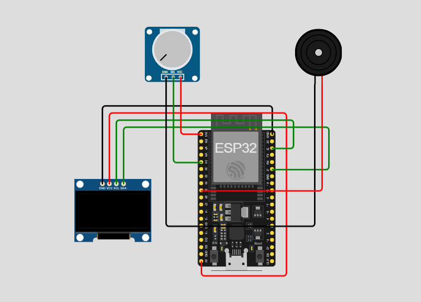

# **Alerta de Medicamento**

Este repositório implementa um sistema de **alerta de medicamento** utilizando um ESP32, display OLED, potenciômetro e buzzer.  
O horário do alerta é configurado através do potenciômetro, e a comunicação ocorre via protocolo **MQTT**, com sincronização automática de horário via **NTP**.

---

## 📷 Protótipo

> *Simulação feita no [Wokwi](https://wokwi.com/).*



---

## 🔧 Componentes Utilizados

* **Placa:** ESP32 DevKit C v4 (simulado no Wokwi)  
* **Display:** OLED monocromático I2C  
* **Entrada:** Potenciômetro (configuração do horário de alerta)  
* **Atuador:** Buzzer piezoelétrico (alerta sonoro)  
* **Comunicação:** Wi-Fi + MQTT via `test.mosquitto.org:1883` + NTP (fuso horário GMT-3)

---

## ⚙️ Como Funciona

1. **Configuração do Horário**  
   O potenciômetro permite ajustar o horário do alerta de 00:00 a 23:59.

2. **Sincronização de Horário**  
   O ESP32 se conecta a um servidor NTP para obter o horário atual automaticamente.

3. **Monitoramento**  
   O sistema compara constantemente o horário atual com o horário configurado pelo usuário.

4. **Alerta Sonoro**  
   Quando o horário atual coincide com o horário configurado:
   * O **buzzer emite um som intermitente** a cada 500 ms  
   * Uma mensagem “CHEGOU A HORA!” é enviada via MQTT  
   * O display OLED exibe o aviso de “ALERTA DE MEDICAMENTO!”

5. **Exibição no Display**  
   O OLED mostra em tempo real:
   * Horário atual  
   * Próximo horário configurado para o medicamento  
   * Mensagem de alerta quando for a hora de tomar

6. **MQTT**  
   * Publicação nos tópicos:
     * `medicamento/horamedicamento` → horário configurado no formato HH:MM  
     * `medicamento/alertamedicamento` → mensagem “CHEGOU A HORA!” quando o alarme dispara  
   * Broker: `test.mosquitto.org`  
   * Porta: `1883`  
   * Cliente MQTT: PubSubClient para ESP32  

---

## 📁 Estrutura de Arquivos

```plaintext
├── sketch.ino       # Código principal do projeto
├── diagram.json     # Diagrama do circuito no Wokwi
└── libraries.txt    # Bibliotecas necessárias
```

## 🚀 Simulação no Wokwi

1. Acesse [https://wokwi.com](https://wokwi.com)  
2. Crie um novo projeto e envie os arquivos:  
   * `sketch.ino`  
   * `diagram.json`  
   * `libraries.txt`  
3. Clique em **Start Simulation**  
4. Abra o **Serial Monitor** para acompanhar as mensagens publicadas via MQTT  
5. Observe o **display OLED** e ajuste o **potenciômetro** para configurar o horário do alerta  

---

## 🛰️ Interfaces e Protocolos

O projeto utiliza comunicação via **MQTT** (Message Queuing Telemetry Transport) e sincronização via **NTP** (Network Time Protocol):

* **Broker MQTT:** `test.mosquitto.org`  
* **Porta:** `1883`  
* **Transporte:** TCP/IP  
* **Cliente MQTT:** PubSubClient  
* **Servidor NTP:** `pool.ntp.org` (GMT-3)  

### Publicações (ESP32 → Broker)

| Tópico                         | Descrição                                                |
| -------------------------------| -------------------------------------------------------- |
| `medicamento/horamedicamento`  | Horário configurado para o medicamento (formato HH:MM)   |
| `medicamento/alertamedicamento`| Mensagem de alerta quando o horário é atingido           |

---

## 🔄 Possíveis Extensões

* Adicionar LED indicador de alerta  
* Configuração remota do horário via MQTT  
* Vários horários programáveis  
* Histórico de alertas disparados  
* Integração com Node-RED para visualização em painel  

---

## 📜 Licença

Este projeto está licenciado sob a **MIT License**. Consulte o arquivo `LICENSE` para mais detalhes.
